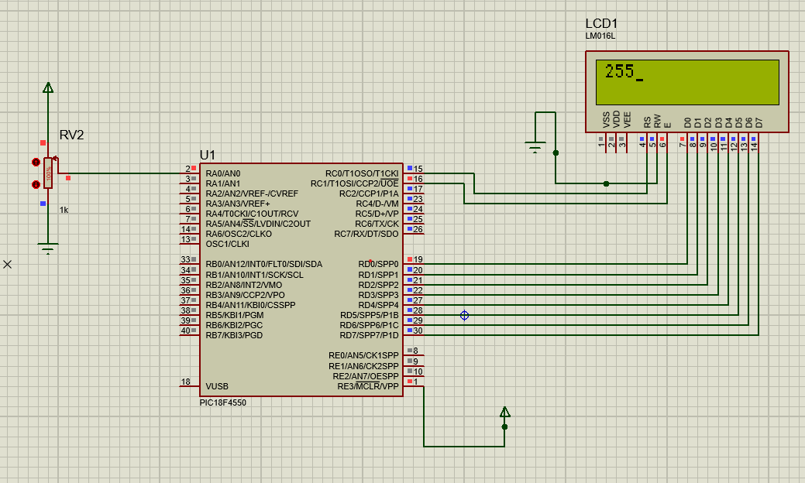

# PIC Microcontroller ADC to LCD Project

## 💡 Overview
This project demonstrates using a **PIC16F4550 microcontroller** to read an analog input via its ADC and display the converted **three-digit decimal value** on a **16x2 LCD**.

---

## 🛠️ Hardware Requirements
- **Microcontroller**: PIC16F4550
- **Display**: 16x2 LCD (e.g., LM016L)
- **Resistor**: 1kΩ (RV2) for LCD contrast

### Connections
- LCD data pins → **PORTD**
- LCD RS, EN → **RC0**, **RC1**
- Analog input → **PORTA** (e.g., RA0)

---

## 💻 Software Requirements
- **Compiler**: MPLAB XC8 (or compatible PIC compiler)
- **Header**: `<pic18.h>` for PIC16F4550 configuration

---

## ⚡ Circuit Diagram


---

## 🧑‍💻 Code

```c
#include <pic18.h>

void delay(){
    int i, j;
    for (i = 0; i < 250; i++) {
        for (j = 0; j < 250; j++) {
        }
    }
}
    
void command(int cmd) {
    LATD = cmd;
    RC0 = 0;
    RC1 = 1;
    delay();
    RC1 = 0;
}

void data(int data) {
    LATD = data;
    RC0 = 1;
    RC1 = 1;
    delay();
    RC1 = 0;
}

void main(void) {
    char a, b, c, d;

    TRISD = 0x00;
    TRISA = 0xFF;
    TRISC = 0x00;

    ADCON0 = 0x01;
    ADCON1 = 0x00;

    delay();

    command(0x38);
    command(0x80);
    command(0x06);
    command(0x0E);
    command(0x01);

    GODONE = 1;

    while (GODONE == 1) {
        a = ADRESH;
        b = ((a / 100) + 48);
        data(b);
        c = (((a % 100) / 10) + 48);
        data(c);
        d = ((a % 10) + 48);
        data(d);
        delay();
        command(0x01);
    }      

    return;
}

```
## ▶️ Usage
- Compile the code using MPLAB XC8.
- Program the PIC16F4550 with the generated hex file.
- Connect the circuit as per the schematic.
- Power on; LCD will display the live ADC value.

## ⚠️ Limitations
- Basic delay function; may need adjustment depending on clock speed.
- ADC accuracy depends on reference voltage; ensure proper calibration.
- No error handling for ADC overflow or invalid readings.

## 📄 License
This project is shared for educational purposes only. Unauthorized reproduction or distribution is prohibited.

## 🙏 Acknowledgments
Designed and tested on a PIC16F4550 development board with a standard 16x2 LCD module.

## 📚 Resources
- [PIC16F4550 Datasheet](https://ww1.microchip.com/downloads/en/DeviceDoc/39632e.pdf)
- [16x2 LCD Datasheet](https://www.sparkfun.com/datasheets/LCD/HDM16216H-5.pdf)
- [Proteus Design Suite](https://www.labcenter.com/)