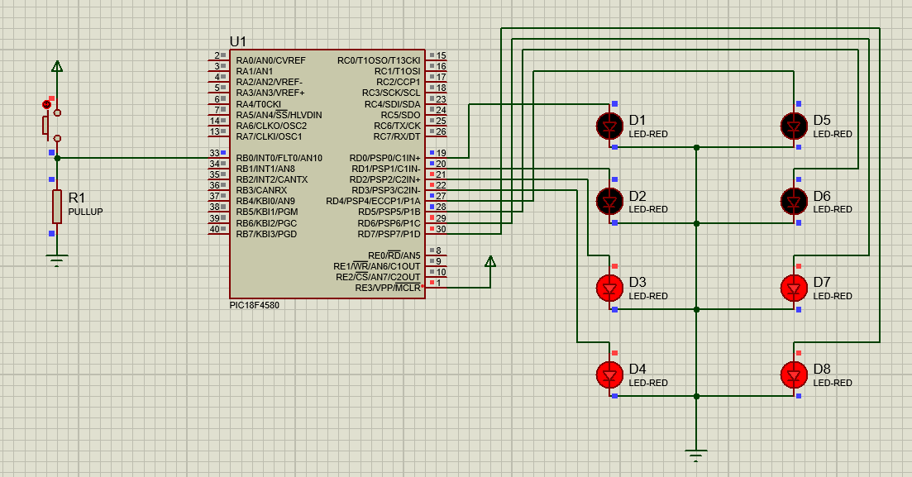

# PIC Microcontroller LED Control Project

## 💡 Overview
This project demonstrates using a **PIC18F4580 microcontroller** to control eight red LEDs connected to PORTD. The LEDs toggle in a sequence (`0xCC`, `0x33`, `0x00`) when an **external interrupt** is triggered on INT0 (pin RB0).

---

## 🛠️ Hardware Requirements
- **Microcontroller**: PIC18F4580
- **LEDs**: 8 red LEDs (D1 to D8)
- **Resistor**: 1kΩ pull-up resistor for interrupt pin

### Connections
- LEDs → PORTD pins (RD0 to RD7)
- Interrupt input (INT0) → RB0 with 1kΩ pull-up resistor
- Ground and VCC connections as per schematic

---

## 💻 Software Requirements
- **Compiler**: MPLAB XC8 (or compatible)
- **Header**: `<xc.h>` for PIC18F4580 configuration

---

## ⚡ Circuit Diagram


---

## 💡 How the Interrupt Works

### What is an interrupt?
An interrupt is an event that temporarily halts the main program execution and transfers control to a special function called the **Interrupt Service Routine (ISR)**.

### INT0 usage
- INT0 (RB0) is configured as an external interrupt pin.
- It detects a **falling edge signal** (when RB0 is momentarily connected to ground).
- When triggered, it sets the interrupt flag `INT0IF`, causing the PIC to jump to the ISR.

### ISR implementation
In this project:
- When `INT0IF` becomes `1`, the ISR runs.
- LEDs on PORTD are cycled through a pattern (`0xCC`, `0x33`, `0x00`) with delays.
- After finishing, `INT0IF` is cleared to allow future interrupts.

---

## 🧑‍💻 Code

```c
#include <xc.h>

void delay();

void main(void) {
    TRISD = 0x00;  // PORTD as output (LEDs)
    TRISB = 0xFF;  // PORTB as input
    ADCON1 = 0x0F; // Configure all pins as digital
    GIE = 1;       // Enable global interrupts
    PEIE = 1;      // Enable peripheral interrupts
    INT0IE = 1;    // Enable external interrupt INT0

    return;
}

void __interrupt() isr(void) {
    while (INT0IF == 1) {
        LATD = 0xCC;
        delay();
        LATD = 0x33;
        delay();
        LATD = 0x00;
        INT0IF = 0; // Clear interrupt flag
    }
}

void delay() {
    int i, j;
    for (i = 0; i < 600; i++) {
        for (j = 0; j < 600; j++) {
        }
    }
}

```
## ▶️ Steps to Use & Test
1️⃣ Compile the code using MPLAB XC8.
2️⃣ Program the PIC18F4580 with the generated HEX file.
3️⃣ Assemble the circuit exactly as per the schematic (interrupt.png).
4️⃣ Power on the board.
5️⃣ Momentarily connect RB0 to ground (by pressing a button or touching a wire to GND).
6️⃣ Observe the LEDs cycle through the pattern: 0xCC, 0x33, 0x00.
7️⃣ The LEDs remain off (0x00) until the interrupt is triggered again.

## ⚠️ Limitations
- The delay function is basic and may need tuning depending on the clock frequency.
- No debounce circuit on RB0; spurious triggering may occur. Consider using a hardware debounce (capacitor + resistor) or software debounce.
- LED pattern is fixed in code; modify LATD values to change the pattern.

## 📄 License
This project is shared for educational purposes only. Unauthorized reproduction or distribution is prohibited.

## 🙏 Acknowledgments
Designed and tested on a PIC18F4580 development board with standard red LEDs.

## 📚 Resources
- [PIC18F4580 Datasheet](https://ww1.microchip.com/downloads/en/DeviceDoc/39626b.pdf)