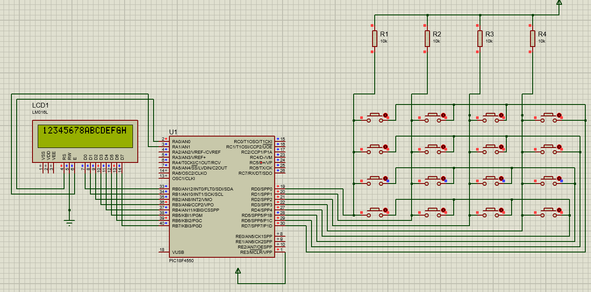

# PIC Microcontroller Keypad to LCD Project

## 💡 Overview
This project demonstrates using a **PIC18F4550 microcontroller** to interface a **4x4 keypad** with a **16x2 LCD**. When a key is pressed, the corresponding character is displayed on the LCD in real time.

---

## 🛠️ Hardware Requirements
- **Microcontroller**: PIC18F4550
- **Display**: 16x2 LCD (e.g., LM016L)
- **Input**: 4x4 Keypad
- **Resistors**: 10kΩ (4 units) for keypad pull-ups

### Connections
- LCD data pins → **PORTB**
- LCD RS, EN → **RA0**, **RA1**
- Keypad rows → **PORTD bits 0–3**
- Keypad columns → **PORTD bits 4–7** with 10kΩ pull-ups

---

## 💻 Software Requirements
- **Compiler**: MPLAB XC8 (or compatible PIC compiler)
- **Header**: `<pic18.h>` for PIC18F4550 configuration

---

## ⚡ Circuit Diagram


---

## 🧑‍💻 Code

```c
#include <pic18.h>

void delay();
void command(int);
void dat(char);
char key();

void delay() {
    int i, j;
    for (i = 0; i < 600; i++) {
        for (j = 0; j < 200; j++) {}
    }
}

void command(int cmd) {
    LATB = cmd;
    RA0 = 0;
    RA1 = 1;
    delay();
    RA1 = 0;
}

void dat(char data) {
    LATB = data;
    RA0 = 1;
    RA1 = 1;
    delay();
    RA1 = 0;
}

void main(void) {
    TRISA = 0x00;
    TRISB = 0x00;
    ADCON1 = 0x0F;
    TRISC = 0x00;
    TRISD = 0x0F;

    command(0x38);
    command(0x80);
    command(0x06);
    command(0x0E);
    command(0x01);

    char b;
    while (1) {
        b = key();
        dat(b);
    }
}

char key() {
    int e;
    while (1) {
        PORTD = 0x7F;
        e = PORTD & 0x0F;
        switch (e) {
            case 0x07: return '4';
            case 0x0B: return '3';
            case 0x0D: return '2';
            case 0x0E: return '1';
        }

        PORTD = 0xBF;
        e = PORTD & 0x0F;
        switch (e) {
            case 0x07: return '8';
            case 0x0B: return '7';
            case 0x0D: return '6';
            case 0x0E: return '5';
        }

        PORTD = 0xDF;
        e = PORTD & 0x0F;
        switch (e) {
            case 0x07: return 'D';
            case 0x0B: return 'C';
            case 0x0D: return 'B';
            case 0x0E: return 'A';
        }

        PORTD = 0xEF;
        e = PORTD & 0x0F;
        switch (e) {
            case 0x07: return 'H';
            case 0x0B: return 'G';
            case 0x0D: return 'F';
            case 0x0E: return 'E';
        }
    }
}

```

## ▶️ Usage
- Compile using MPLAB XC8.
- Program the PIC18F4550 with the generated hex file.
- Connect the circuit as per schematic.
- Power on; LCD will show pressed keys live.

## ⚠️ Limitations
- Basic delay; adjust based on clock frequency.
- No keypad debounce; add for improved reliability.
- Code assumes a specific keypad layout — verify with your hardware.

## 📄 License
Shared for educational purposes only. Unauthorized reproduction or distribution is prohibited. See the [LICENSE](LICENSE) file for details.

## 🙏 Acknowledgments
Designed and tested on a PIC18F4550 development board with a standard 16x2 LCD module.

## 📚 Resources
- [PIC18F4550 Datasheet](https://ww1.microchip.com/downloads/en/DeviceDoc/39632e.pdf)
- [16x2 LCD Datasheet](https://www.sparkfun.com/datasheets/LCD/HDM16216H-5.pdf)
- [Proteus Design Suite](https://www.labcenter.com/)