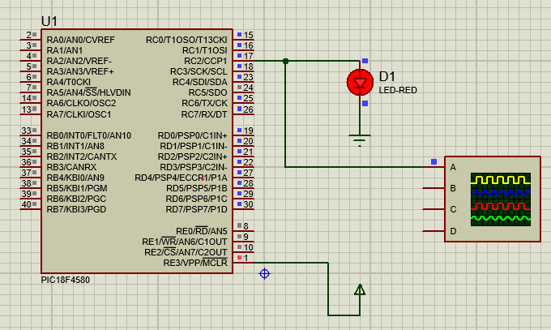
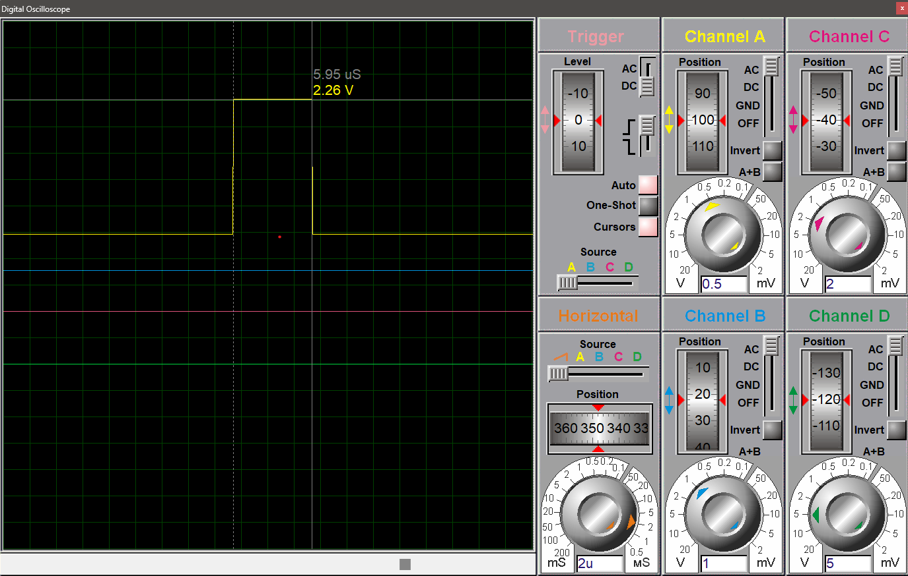

# PIC Microcontroller PWM Generation Project

## 💡 Overview
This project demonstrates using a **PIC18F4580 microcontroller** to generate a PWM (Pulse Width Modulation) signal using the CCP1 module and visualize it on an oscilloscope. The duty cycle smoothly ramps from 0 to maximum (0–255) continuously.

---

## 🛠️ Hardware Requirements
- **Microcontroller**: PIC18F4580
- **LED**: Red LED (optional to visualize brightness)
- **Oscilloscope**: To observe the PWM waveform
- **Resistor**: Current-limiting resistor for LED if used

### Connections
- PWM output → RC2 (CCP1 pin)
- LED anode → RC2 (via resistor), cathode → GND
- Oscilloscope probe connected to RC2 for measurement

---

## 💻 Software Requirements
- **Compiler**: MPLAB XC8 (or compatible)
- **Header**: `<xc.h>`

---

## ⚡ Circuit Diagram


---

## 📈 Oscilloscope Output


---

## 💡 How PWM is Implemented

### CCP1 module
- The CCP1 module is configured in PWM mode (`CCP1CON = 0x0C`).
- Timer2 acts as the time base and controls the PWM period.
- Duty cycle is updated continuously by writing to `CCPR1L`.

### Code behavior
- Starts with a 0% duty cycle (`CCPR1L = 0`).
- Gradually increases to 100% (`CCPR1L = 255`) inside a loop.
- Delay function controls how fast the duty cycle changes.
- Oscilloscope displays changing pulse width as duty cycle ramps.

---

## 🧑‍💻 Code

```c
#include <xc.h>

void delay();

void main(void) {
    // Oscillator and PORT setup
    TRISD = 0x00;     // PORTD as output (optional)
    TMR0L = 0;        // Timer0 register
    T0CON = 0xC7;     // Timer0 ON, prescaler 1:256

    // PWM setup
    TRISC = 0x20;     // RC5 as input, RC2 (CCP1) as output
    CCP1CON = 0x0C;   // PWM mode
    TMR2ON = 1;       // Enable Timer2
    TMR2 = 0x00;      // Clear Timer2

    int i;
    while (1) {
        for (i = 0; i < 256; i++) {
            CCPR1L = i;  // Update duty cycle
            delay();
        }
    }
}

void delay() {
    int i, j;
    for (i = 0; i < 500; i++) {
        for (j = 0; j < 500; j++) {
        }
    }
}

```

## ▶️ Steps to Build & Test
1️⃣ Compile code using MPLAB XC8.
2️⃣ Program the PIC18F4580 with generated HEX file.
3️⃣ Connect LED (if using) and oscilloscope as shown in schematic.
4️⃣ Power up the board.
5️⃣ Observe:
   - LED brightness gradually increases and cycles.
   - Oscilloscope waveform shows pulse width widening from narrow (0% duty) to full (100%).

## ⚠️ Important Notes
- Interrupts are not used here; PWM is generated entirely in hardware using the CCP1 module.
- The delay function is basic and may be adjusted to change the duty cycle ramp speed.
- You can connect a DC motor or fan to test real-life PWM control (via proper driver circuit).

## 📄 License
This project is shared for educational purposes only. Unauthorized reproduction or distribution is prohibited.

## 🙏 Acknowledgments
Designed and tested on a PIC18F4580 development board, verified using Proteus simulation and oscilloscope.

## 📚 Resources
- [PIC18F4580 Datasheet](https://ww1.microchip.com/downloads/en/DeviceDoc/39626b.pdf)
- [Proteus Design Suite](https://www.labcenter.com/)
