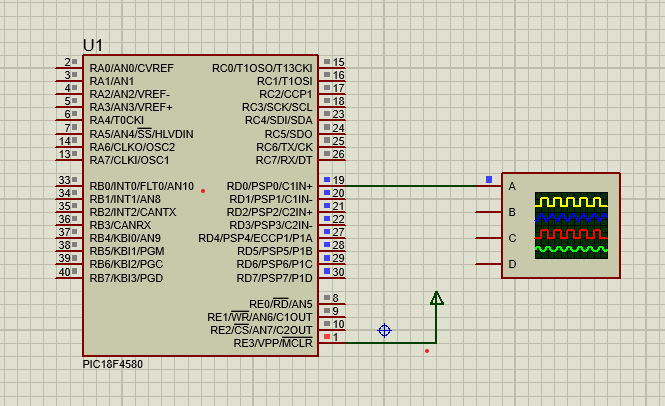

# PIC18F4580 Timer1 Delay Generation

## 💡 Overview
This project demonstrates using **Timer1** of the PIC18F4580 microcontroller to create an **accurate 10 ms delay**. The delay is used to toggle PORTD between high and low repeatedly, generating a square wave output.  

The waveform can be observed on an oscilloscope to verify timing.

---

## 🛠️ Hardware Requirements

- **Microcontroller**: PIC18F4580
- **Oscilloscope**: To view timing and square wave
- **Optional LEDs**: To observe blinking
- **Power supply**: 5V regulated

### Connections

- **PORTD** (RD0–RD7): Connect to oscilloscope probe or LED anodes (with resistors).
- Common ground shared with oscilloscope.

---

## 🗺️ Circuit Diagram



---

## 💻 Software Requirements

- **Compiler**: MPLAB XC8 (or compatible)
- **Header**: `<pic18.h>`

---

## ⏰ What is Timer1?

A timer is a hardware feature in microcontrollers that counts clock pulses to measure time intervals.  
**Timer1** is a 16-bit timer in PIC18F4580, allowing precise time-based events without blocking the CPU (though here, we use polling).

---

## 🧮 Delay Calculation

The delay time is calculated using:

Delay = (65536 - TMR1 preload) × Tosc × Prescaler

Where:  
- **65536**: Max value of a 16-bit timer.  
- **TMR1 preload**: Initial value loaded into TMR1 (TMR1H:TMR1L).  
- **Tosc**: Oscillator period = 1 / Fosc.  
- **Prescaler**: Value configured in T1CON (here, set to 8).

### In this project

- **Fosc** = 20 MHz → Tosc = 1 / 20 MHz = 50 ns.
- **Prescaler** = 8.
- **TMR1 preload** = 0xE796 (hex) = 59286 (decimal).

Delay = (65536 - 59286) × 50 ns × 8= 6249 × 50 ns × 8= 6249 × 400 ns≈ 2.5 ms

⚠️ In your simulation, the total waveform period is about 20 ms (10 ms high, 10 ms low).  
Hence, each half cycle (high or low) uses a **2.5 ms timer delay** in the simulation, repeated four times or adjusted for practical approximate 10 ms.

---

## ⚙️ How it works

- Load TMR1 with preload value (0xE796).
- Wait until **TMR1IF** flag is set (indicating overflow).
- Toggle PORTD.
- Clear **TMR1IF**.
- Repeat.

---

## 🧑‍💻 Code

```c
#include <pic18.h>

void timer();

void main(void) {
    TRISD = 0x00;    // PORTD as output
    TMR1L = 0x96;    // Load low byte
    TMR1H = 0xE7;    // Load high byte
    T1CON = 0x79;    // Enable Timer1, prescaler 8

    while (1) {
        LATD = 0xFF; // PORTD high
        timer();
        LATD = 0x00; // PORTD low
        timer();
    }
}

void timer() {
    while (TMR1IF == 0); // Wait for overflow
    TMR1IF = 0;          // Clear overflow flag
    TMR1L = 0x96;        // Reload low byte
    TMR1H = 0xE7;        // Reload high byte
}

```

## 📊 Oscilloscope Output


🪜 Steps to Build & Test
1️⃣ Write the code in MPLAB IDE.2️⃣ Compile using XC8 compiler to generate hex file.3️⃣ Flash to PIC18F4580 microcontroller.4️⃣ Connect PORTD pins to oscilloscope or LEDs.5️⃣ Apply power and observe toggling every ~10 ms.

## 💬 Additional Notes

You can change TMR1 preload to adjust the delay.
Use the calculation formula to target precise delays for different applications.


## ⚠️ Limitations

Uses polling method; CPU waits for timer overflow (not efficient).
In real-world applications, using interrupt service routine (ISR) is better for non-blocking delays.


## 📄 License
This project is shared for educational purposes only. Unauthorized reproduction or distribution is prohibited.

## 🙏 Acknowledgments
Designed and simulated with Proteus using a PIC18F4580 development setup.

## 📚 Resources

- [PIC18F4580 Datasheet](https://ww1.microchip.com/downloads/en/DeviceDoc/39626b.pdf)
- [Proteus Design Suite](https://www.labcenter.com/)


