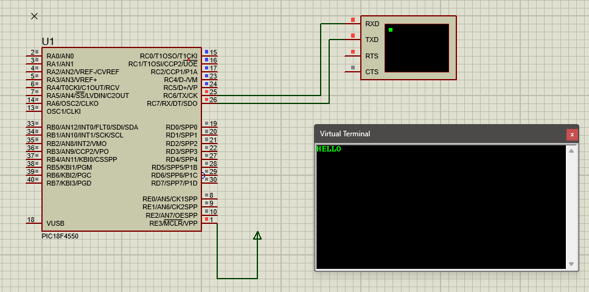

# PIC18F4550 USART Serial Communication Example

## 💡 Overview
This project demonstrates using the **USART (Universal Synchronous Asynchronous Receiver Transmitter)** of the PIC18F4550 microcontroller to send a simple "HELLO" string to a virtual terminal via serial communication.

---

## 🛠️ Hardware Requirements

- **Microcontroller**: PIC18F4550
- **USB-UART converter or virtual terminal (Proteus)**
- **Optional**: PC terminal software (e.g., Tera Term, PuTTY)

### Connections

- **TX (Transmit)** → Virtual terminal RXD
- **Ground** → Virtual terminal GND

---

## 🗺️ Circuit Diagram



---

## 💻 Software Requirements

- **Compiler**: MPLAB XC8 (or compatible)
- **Simulator**: Proteus Design Suite (for virtual terminal)
- **Header**: `<xc.h>`

---

## ⚙️ How it works

- **USART** is configured in asynchronous mode for serial transmission.
- Baud rate generator value (`SPBRG`) is set for 9600 baud with Fosc = 20 MHz (value: 129).
- Characters of the message "HELLO" are sent one by one via `TXREG`.
- The virtual terminal receives and displays the string.

---

## 🧑‍💻 Code

```c
#include <xc.h>

void main(void) {

    TRISC = 0x80;   // RC7 (RX) input, RC6 (TX) output
    TXSTA = 0x24;   // TX enable, BRGH = 1 (high speed)
    RCSTA = 0x90;   // Serial port enable, continuous receive enable
    SPBRG = 129;    // Baud rate 9600 for 20 MHz clock

    char *message = "HELLO";
    char i = 0;

    while (message[i] != '\0') {
        TXREG = message[i];        // Load character into TX register
        while (TXIF == 0);         // Wait for transmit interrupt flag
        TXIF = 0;                  // Clear flag (done automatically in hardware)
        i++;
    }

    while (1);  // Infinite loop to keep MCU running
}

```

## ⚖️ Baud Rate Calculation
The baud rate is calculated using:

Baud Rate = Fosc / (16 * (SPBRG + 1))


For Fosc = 20 MHz and desired baud = 9600:

SPBRG = (Fosc / (16 * Baud)) - 1 SPBRG = (20,000,000 / (16 * 9600)) - 1 ≈ 129


## 🪜 Steps to Build & Simulate
1️⃣ Write the code in MPLAB IDE and compile using XC8.
2️⃣ Generate and load the hex file into Proteus simulation.
3️⃣ Connect RC6 (TX) pin to virtual terminal RXD in Proteus.
4️⃣ Start simulation; "HELLO" will be displayed on the virtual terminal.
5️⃣ (Optional) Connect to a real PC terminal using USB-UART converter if testing on hardware.


## ⚠️ Notes
- Baud rate configuration depends on crystal frequency. Adjust SPBRG if using a different clock.
- No receive functionality implemented here; only transmit.
- RC6 (TX) must be set as output, RC7 (RX) as input.


## 📄 License
This project is shared for educational purposes only. Unauthorized reproduction or distribution is prohibited.

## 🙏 Acknowledgments
Designed and simulated using Proteus with a PIC18F4550 development setup.

## 📚 Resources
- [PIC18F4550 Datasheet](https://ww1.microchip.com/downloads/en/DeviceDoc/39632e.pdf)
- [Proteus Design Suite](https://www.labcenter.com/downloads/)
